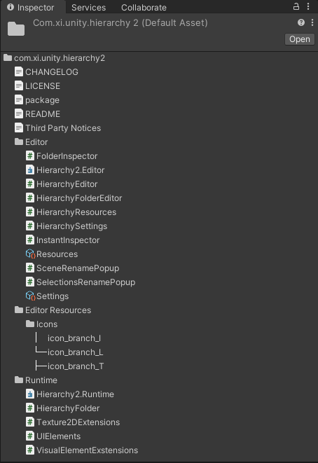

# [Xi Hierarchy](https://github.com/oovm/Xi-Hierarchy) - Enhanced Hierarchy View


## Install

There are two common methods for installing this package.

### Through [Unity Package Manager](https://docs.unity3d.com/Manual/upm-ui-giturl.html)

```sh

```

### Through [OpenUPM](https://openupm.com/)

```sh
# npm install -g openupm-cli
openupm add com.omiyagames.template
```

## Resources

### Folder Inspector

Preview the folder structure in the Inspector:




## LICENSE

Fork from: https://github.com/truongnguyentungduy/hierarchy-2

